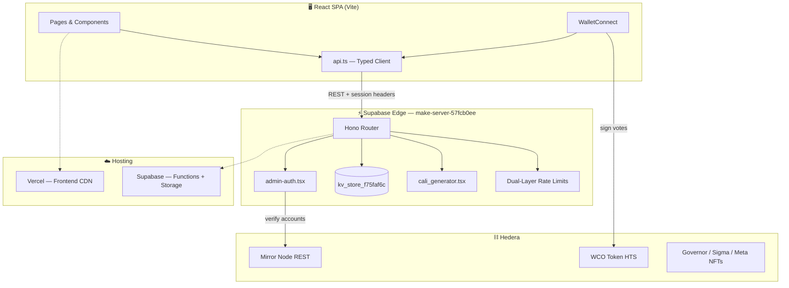
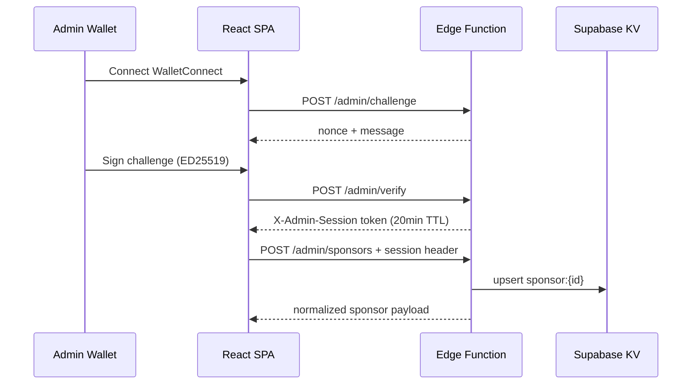

<p align="center">
  
</p>

<h1 align="center">WCO Platform</h1>
<h3 align="center">Battle of the Bars · Token-Weighted Voting · Calisthenics Engine</h3>

<p align="center">
  <strong>The official Web3 platform for the <a href="https://worldcalisthenics.org">World Calisthenics Organization</a>.</strong><br/>
  Athletes compete. Fans vote with <code>WCO</code> tokens. Governors govern. Sponsors fuel the grind.
</p>

<p align="center">
  <a href="https://www.wcorg.io"></a>
  <a href="https://github.com/POSTwco/Wcobotbv2"></a>
  <a href="https://worldcalisthenics.org"></a>
</p>

<p align="center">
  <a href="https://x.com/WCO_ORG"></a>
  <a href="https://discord.com/invite/Zt52bf8Ve"></a>
  <a href="https://www.youtube.com/@WorldCalisthenicsOrg"></a>
  <a href="https://www.instagram.com/world_calisthenics_org/"></a>
</p>

<p align="center">
  
  
  
  
  
  
  
  
</p>

<p align="center">
  
  
  
  
</p>

---

<!-- omit in toc -->
## Table of Contents

- [What is this?](#what-is-this)
- [Platform at a Glance](#platform-at-a-glance)
- [Architecture](#architecture)
- [Backend Deep Dive](#backend-deep-dive)
- [Sponsor Tier System](#sponsor-tier-system)
- [Security Model](#security-model)
- [Project Structure](#project-structure)
- [Quick Start](#quick-start)
- [Deployment](#deployment)
- [API Cheat Sheet](#api-cheat-sheet)
- [Contributing](#contributing)
- [Brand Kit](#brand-kit)

---

## What is this?

```
 ██╗    ██╗ ██████╗ ██████╗
 ██║    ██║██╔════╝██╔═══██╗     World Calisthenics Organization
 ██║ █╗ ██║██║     ██║   ██║     ─────────────────────────────
 ██║███╗██║██║     ██║   ██║     React SPA  ──►  Vercel
 ╚███╔███╔╝╚██████╗╚██████╔╝     Hono API   ──►  Supabase Edge
  ╚══╝╚══╝  ╚═════╝ ╚═════╝      Hedera     ──►  Mirror Node + HTS
```

**Wcobotbv2** is the production codebase for WCO's interactive fan platform — originally scoped as *Battle of the Bars (BOTB)*. It ships a full-stack experience:

| Surface | What it does |
|---------|--------------|
| **Battles** | Token-weighted voting on live calisthenics matchups |
| **Governance** | 100 Governor NFT holders propose and vote on platform decisions |
| **Athletes** | Profiles, skill ratings, weight classes, NFT cards |
| **Arena Chat** | Real-time fan chat with verified athlete + governor badges |
| **Calisthenics** | AI-generated workout routines, PR tracking, XP progression |
| **Sponsors** | Multi-tier sponsorship with impression/click analytics |
| **Admin** | Hedera wallet challenge-sign command center for WCO ops |

> **For backend engineers:** this is a **KV-first edge API** with layered auth, dual rate-limiting, and mirror-node wallet verification — not a traditional CRUD monolith. The interesting bits are in `supabase/functions/make-server-57fcb0ee/`.

---

## Platform at a Glance

<p align="center">
  
  &nbsp;&nbsp;&nbsp;
  
</p>

<details>
<summary><strong>🗳️ Voting & Rewards</strong></summary>

- Connect via **WalletConnect** (HashPack, Blade, etc.)
- Cast **token-weighted votes** on battles — stake more `WCO`, carry more weight
- Batch-vote up to 12 battles in a single signed transaction
- Winners trigger **reward snapshots** → CSV export → batch airdrop scripts

</details>

<details>
<summary><strong>🏛️ Governance</strong></summary>

- **100 fixed-supply Governor NFTs** gate proposal creation
- Skill rating changes, platform config, meta-series matchups
- Proposal votes require wallet session + ED25519 signature verification

</details>

<details>
<summary><strong>💪 Calisthenics Engine</strong></summary>

- Personalized workout generation with motion-reference assets
- Set logging, PR history, XP progression, coach messaging
- **Routine Sponsor banners** render below each workout block (gold tier)

</details>

<details>
<summary><strong>🛡️ Admin Command Center</strong></summary>

- Challenge-sign auth flow (20-minute session TTL)
- Athlete/event/battle CRUD, bracket generation, winner declaration
- Sponsor management, application review, snapshot exports
- Phase-2 test tools for staging resets (gated behind admin session)

</details>

---

## Architecture



### Request flow (admin write)



### Dual deploy pipeline

| Layer | Trigger | Command |
|-------|---------|---------|
| **Frontend** | Auto on `git push` to `main` | Vercel picks up Vite build |
| **Edge API** | **Manual** | `pnpm run deploy:edge` |

> ⚠️ **Deploy mismatch is the #1 production footgun.** Frontend and edge function deploy independently. A pushed commit that adds a new API field (e.g. `routine` sponsor tier) will silently fail until you manually deploy the edge function. Always pair frontend pushes with `deploy:edge` when touching `supabase/functions/`.

---

## Backend Deep Dive

### KV key conventions

All persistent state lives in `kv_store_f75faf6c` (Postgres JSONB under the hood):

```
athlete:{id}                        → Athlete
event:{id}                          → BattleEvent
battle:{id}                         → Battle
proposal:{id}                       → Proposal
vote:battle:{battleId}:{wallet}     → BattleVote
vote:proposal:{proposalId}:{wallet} → ProposalVote
snapshot:{battleId}                 → RewardSnapshot
config:site                         → SiteConfig
sponsor:{id}                        → Sponsor
sponsor-inquiry:{id}                → SponsorInquiry
session:admin:{token}               → Admin session
session:wallet:{token}              → Wallet session
rate:{scope}:{id}                   → Rate limit counters
```

### Auth header matrix

| Route class | Headers required |
|-------------|------------------|
| **Public read** | `Authorization: Bearer <anon_key>` |
| **Wallet write** | `+ X-Wallet-Session` (post WalletConnect register) |
| **Vote write** | `+ ED25519 signature in body` |
| **Admin read** | `+ X-Admin-Session` |
| **Admin write** | `+ X-Admin-Session` |

### Rate limiting (dual-layer)

1. **In-memory** fast path inside the Deno isolate
2. **KV-backed** counters that survive isolate restarts

| Endpoint family | Limit |
|-----------------|-------|
| Global | 120 req/min per IP |
| Admin challenge | 3 per 5 min |
| Votes | 10/min per wallet |
| Arena chat | 5/min per wallet |
| Sponsor impressions | 3/min per sponsor per IP |
| Sponsor clicks | 3/min per sponsor per IP |

### CORS policy

Three-tier origin checker — **never** emits `Access-Control-Allow-Origin: *`. Origins are individually reflected and audit-logged per request.

---

## Sponsor Tier System

Sponsors support **multi-tier** placement across the platform:

| Tier | Badge | Placement |
|------|-------|-----------|
| `title` | 🏆 TITLE | Hero banner, homepage showcase |
| `premium` | ⭐ PREMIUM | Sidebar strips, battle cards |
| `standard` | 🔵 STANDARD | Footer carousel, general rotation |
| `routine` | 🥇 ROUTINE | Gold tab below calisthenics workout blocks |

```ts
// src/app/lib/sponsor-display.ts
export function hasTier(sp: Sponsor, tier: SponsorTier): boolean {
  if (sp.tiers?.length) return sp.tiers.includes(tier);
  return sp.tier === tier; // legacy single-tier fallback
}
```

**Analytics pipeline:** public `POST /sponsors/:id/impression` and `POST /sponsors/:id/click` endpoints with KV-backed IP rate limits feed admin dashboards.

---

## Security Model

| Layer | Implementation |
|-------|----------------|
| Wallet proof | Mirror node account verification |
| Vote integrity | ED25519 signature + session token |
| Admin access | Challenge-sign → short-lived session |
| Input sanitization | `sanitizeString`, `sanitizeUrl`, `sanitizeNumber` on all writes |
| Error responses | Frontend strips stack traces, keys, connection strings |
| Pen testing | 100% pass rate across 39 attack vectors (archived in `security-*.tsx`) |

<details>
<summary><strong>🔐 Admin auth flow (curl)</strong></summary>

```bash
# 1. Request challenge
curl -X POST "https://wotsoauebnoyvegcvouo.supabase.co/functions/v1/make-server-57fcb0ee/admin/challenge" \
  -H "Authorization: Bearer $SUPABASE_ANON_KEY" \
  -H "Content-Type: application/json" \
  -d '{"wallet":"0.0.YOUR_ADMIN_ACCOUNT"}'

# 2. Sign the returned message with your Hedera wallet, then verify
curl -X POST "https://wotsoauebnoyvegcvouo.supabase.co/functions/v1/make-server-57fcb0ee/admin/verify" \
  -H "Authorization: Bearer $SUPABASE_ANON_KEY" \
  -H "Content-Type: application/json" \
  -d '{"wallet":"0.0.YOUR_ADMIN_ACCOUNT","signature":"BASE64_SIG","nonce":"NONCE_FROM_CHALLENGE"}'

# 3. Use returned session token for writes
curl "https://wotsoauebnoyvegcvouo.supabase.co/functions/v1/make-server-57fcb0ee/admin/sponsors" \
  -H "Authorization: Bearer $SUPABASE_ANON_KEY" \
  -H "X-Admin-Session: SESSION_TOKEN"
```

</details>

---

## Project Structure

```
Wcobotbv2/
├── src/
│   ├── app/
│   │   ├── components/       # UI — battles, admin, sponsors, cali, chat
│   │   ├── pages/            # Route-level views
│   │   ├── lib/
│   │   │   ├── api.ts        # ⭐ Typed API client (all endpoints)
│   │   │   ├── types.ts      # ⭐ Shared schemas + KV conventions
│   │   │   ├── hooks.ts      # SWR-style data hooks
│   │   │   └── hedera-config.ts
│   │   └── routes.ts
│   └── assets/               # Motion refs, fingerprint art
├── supabase/
│   └── functions/
│       └── make-server-57fcb0ee/   # ⭐ Production edge API
│           ├── index.tsx          # Hono router (~100+ routes)
│           ├── admin-auth.tsx     # Sessions, rate limits, sanitization
│           ├── kv_store.tsx       # KV abstraction
│           ├── cali_generator.tsx # Workout engine
│           └── scaling.tsx        # Leaderboard cache scaling
├── utils/supabase/info.ts    # Project ID + anon key
└── package.json
```

---

## Quick Start

### Prerequisites

- **Node.js** 20+
- **pnpm** (recommended) or npm
- **Supabase CLI** (for edge deploys)
- A **Hedera testnet wallet** (for voting/admin flows)

### Local development

```bash
git clone https://github.com/POSTwco/Wcobotbv2.git
cd Wcobotbv2
pnpm install
pnpm dev
```

Open **http://localhost:5173** — the Vite dev server proxies to the live edge API by default (`src/app/lib/api.ts`).

### Health check

```bash
curl https://wotsoauebnoyvegcvouo.supabase.co/functions/v1/make-server-57fcb0ee/health
```

---

## Deployment

### Frontend → Vercel

Pushes to `main` auto-deploy to [wco-beta.vercel.app](https://wco-beta.vercel.app).

```bash
pnpm build   # local smoke test
git push origin main
```

### Edge API → Supabase

```bash
# Link project (first time)
supabase link --project-ref wotsoauebnoyvegcvouo

# Deploy production function
pnpm run deploy:edge
# equivalent to:
# supabase functions deploy make-server-57fcb0ee --project-ref wotsoauebnoyvegcvouo
```

<details>
<summary><strong>🪟 Windows PowerShell note</strong></summary>

If execution policy blocks `supabase.ps1`:

```powershell
cmd /c "supabase functions deploy make-server-57fcb0ee --project-ref wotsoauebnoyvegcvouo"
```

</details>

### Deploy checklist

- [ ] Frontend changes pushed → Vercel build green
- [ ] Edge function changes deployed → `pnpm run deploy:edge`
- [ ] `GET /health` returns OK
- [ ] `GET /sponsors` reflects latest tier data
- [ ] Admin save → refresh → data persists

---

## API Cheat Sheet

Base URL:

```
https://wotsoauebnoyvegcvouo.supabase.co/functions/v1/make-server-57fcb0ee
```

<details>
<summary><strong>📖 Public routes</strong></summary>

| Method | Path | Description |
|--------|------|-------------|
| `GET` | `/health` | Health check |
| `GET` | `/config` | Site config + feature flags |
| `GET` | `/athletes` | All athletes |
| `GET` | `/battles` | All battles (`?eventId=` filter) |
| `GET` | `/events` | All events |
| `GET` | `/proposals` | Governance proposals |
| `GET` | `/sponsors` | Active sponsors only |
| `GET` | `/leaderboard/athletes` | Composite rankings |
| `GET` | `/leaderboard/voters` | Top voters |
| `GET` | `/chat/messages` | Arena chat history |

</details>

<details>
<summary><strong>🗳️ Wallet session + voting</strong></summary>

| Method | Path | Description |
|--------|------|-------------|
| `POST` | `/wallet/register` | Create wallet session after WC connect |
| `POST` | `/vote/battle` | Token-weighted battle vote |
| `POST` | `/vote/battles/batch` | Batch vote (2–12 battles) |
| `POST` | `/vote/proposal` | Governance proposal vote |
| `GET` | `/vote/allocations/:wallet` | Per-event token allocations |

</details>

<details>
<summary><strong>🛡️ Admin routes</strong></summary>

| Method | Path | Description |
|--------|------|-------------|
| `POST` | `/admin/challenge` | Request signing challenge |
| `POST` | `/admin/verify` | Verify signature → session |
| `POST` | `/admin/athletes` | Create/update athlete |
| `POST` | `/admin/events/generate` | Event + auto-bracket |
| `POST` | `/admin/battles/:id/winner` | Declare winner + snapshot |
| `POST` | `/admin/sponsors` | Create/update sponsor |
| `GET` | `/admin/snapshots/:id/export` | CSV/JSON reward export |

> Full route manifest with security notes: see the header comment in `supabase/functions/make-server-57fcb0ee/index.tsx`.

</details>

---

## Contributing

We welcome PRs from the backend and Web3 community. A few ground rules:

1. **Shared types first** — if you change a schema, update `src/app/lib/types.ts` and the server handler together
2. **Deploy both layers** — frontend-only pushes are not enough for API changes
3. **No secrets in commits** — anon keys in `utils/supabase/info.ts` are public by design; service role keys are not
4. **Match the security model** — new write endpoints need rate limits + sanitization

```bash
# Branch naming
git checkout -b feat/sponsor-analytics-v2
git checkout -b fix/routine-tier-normalization

# Commit style (conventional-ish)
git commit -m "feat(sponsors): add routine tier impression tracking"
git commit -m "fix(edge): normalize sponsor tiers on save"
```

<p align="center">
  <a href="https://github.com/POSTwco/Wcobotbv2/issues"></a>
  <a href="https://github.com/POSTwco/Wcobotbv2/pulls"></a>
</p>

---

## Brand Kit

| Asset | URL |
|-------|-----|
| WCO Logo (white) | [Branding KIT / WCO white on trans.png](https://wotsoauebnoyvegcvouo.supabase.co/storage/v1/object/public/Branding%20KIT%20WCO/WCO%20white%20on%20trans.png) |
| Sigma NFT | [sigmanft.png](https://wotsoauebnoyvegcvouo.supabase.co/storage/v1/object/public/Branding%20KIT%20WCO/sigmanft.png) |
| Meta NFT | [metanft.png](https://wotsoauebnoyvegcvouo.supabase.co/storage/v1/object/public/Branding%20KIT%20WCO/metanft.png) |
| 3D Badge (GLB) | [WCO-badge-diamond.11.glb](https://wotsoauebnoyvegcvouo.supabase.co/storage/v1/object/public/Branding%20KIT%20WCO/WCO-badge-diamond.11.glb) |

### Color palette

| Name | Hex | Usage |
|------|-----|-------|
| WCO Gold | `#D4A843` | Accents, routine sponsors, VIP |
| WCO Blue | `#4274B9` | Primary brand, borders |
| Sky | `#6AA3E0` | Links, highlights |
| Void | `#0B1120` | Background |
| Slate | `#8494A7` | Secondary text |
| Frost | `#E8ECF0` | Primary text |

---

<p align="center">
  <sub>Built with discipline, deployed with intent.</sub><br/>
  <strong>World Calisthenics Organization</strong> · <a href="https://worldcalisthenics.org">worldcalisthenics.org</a> · <a href="https://www.youtube.com/@WorldCalisthenicsOrg">YouTube</a>
</p>

<p align="center">
  
</p>